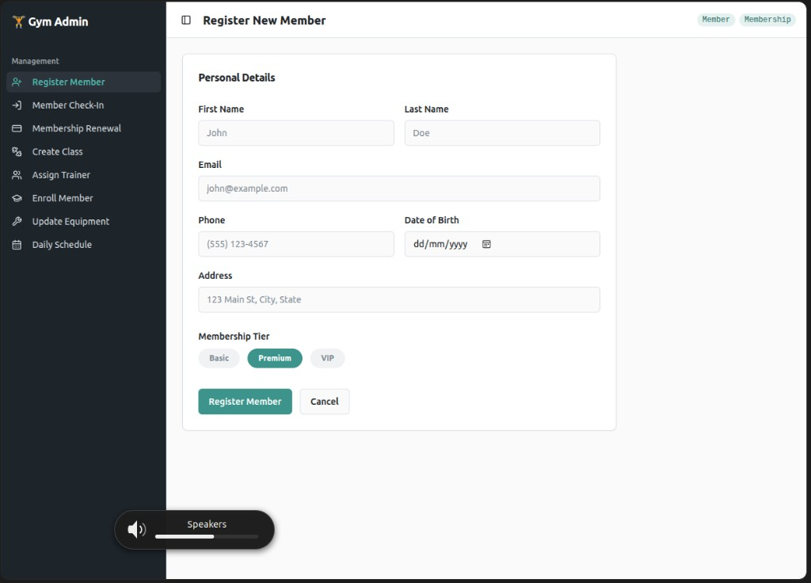
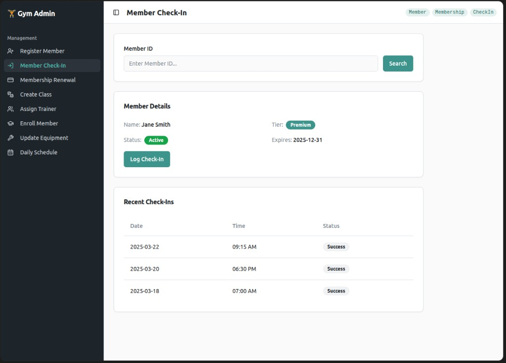
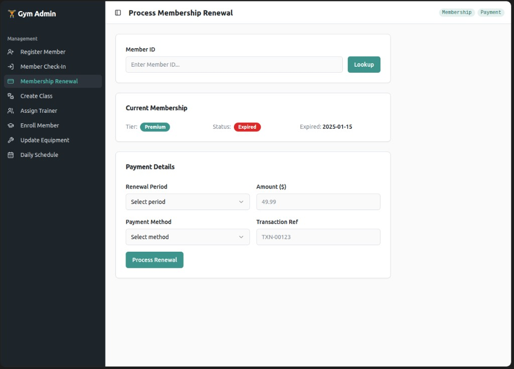
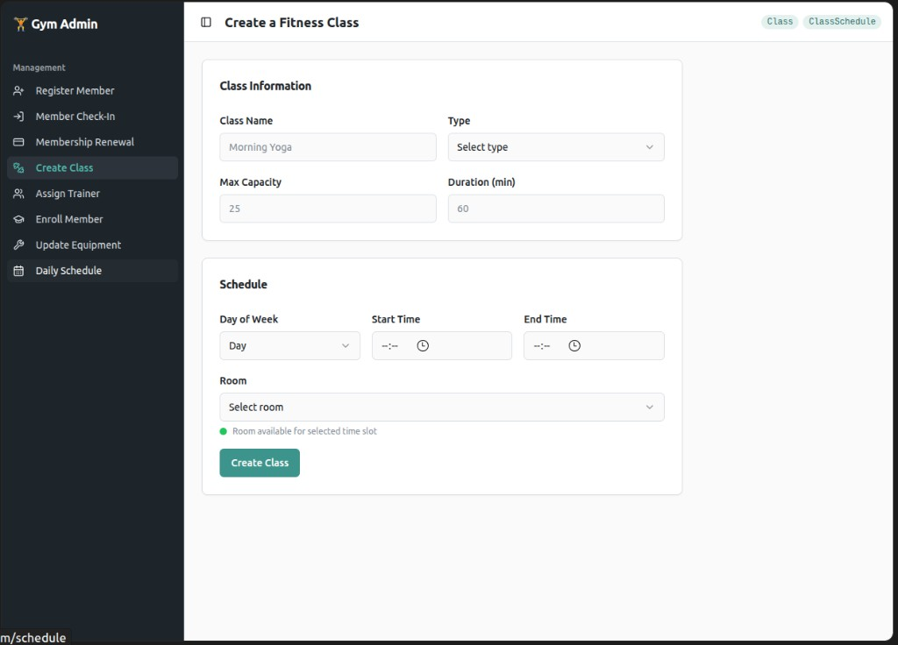
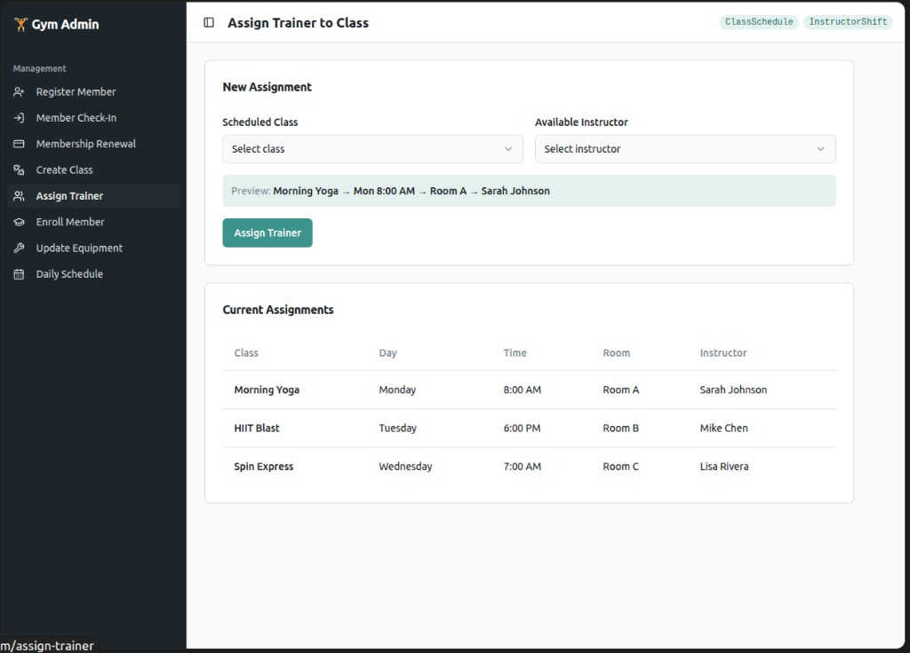
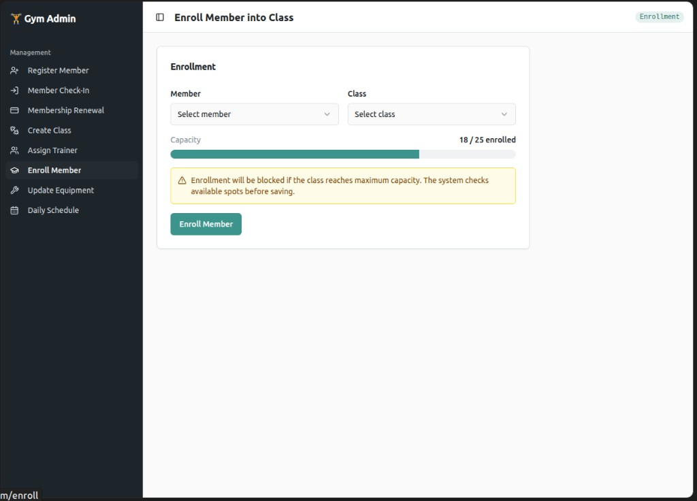
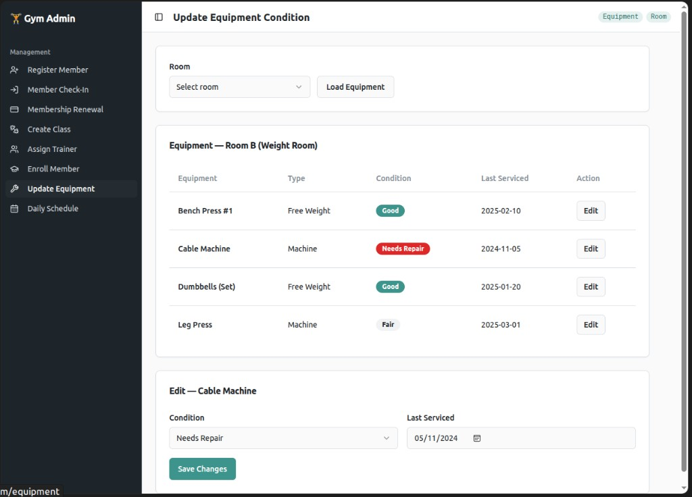
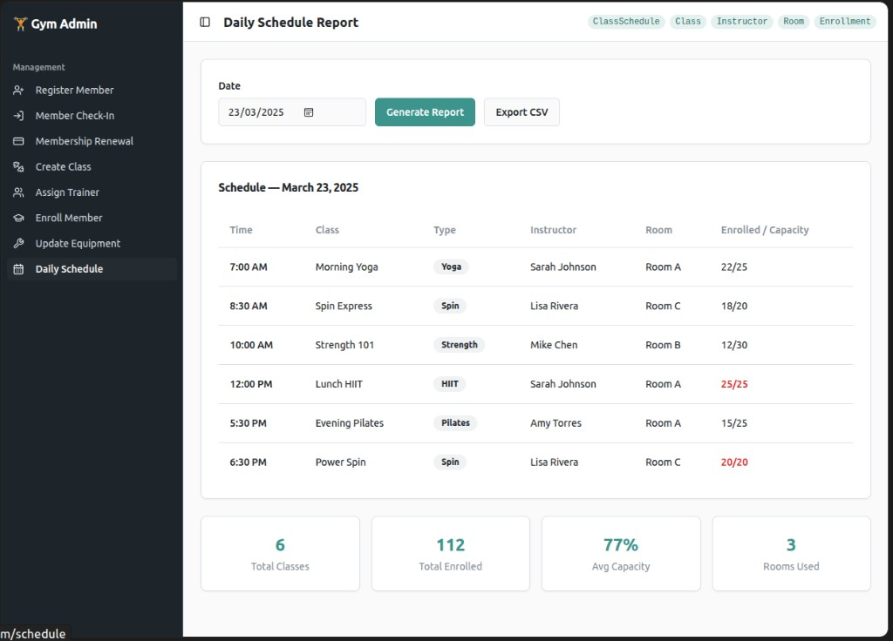
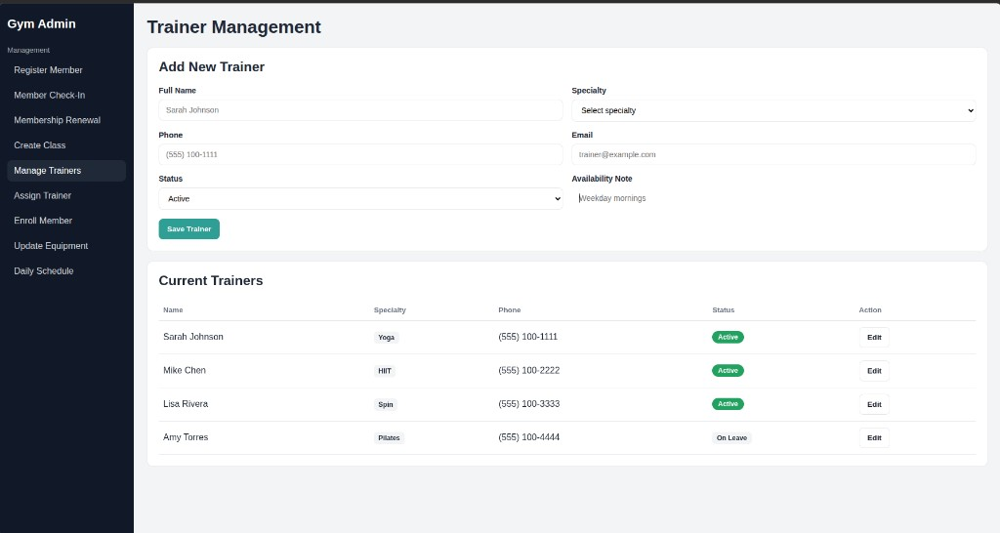

# Gym & Fitness Center Management System (Django UI Phase)

This project is a Django-based admin tool for managing day-to-day gym operations.

Current status: **Phase III Database Implementation**. The project now utilizes full Django ORM models mapping to a PostgreSQL database, environment configuration via python-decouple, and structured testing.

## Tech Stack

- Python 3
- Django 5
- PostgreSQL (via psycopg2-binary)
- Python Decouple (Environment management)
- Django Template Language (MVT)
- Custom CSS

## Project Structure

- `gym_system/` - Django project config (`settings.py`, main `urls.py`)
- `member_access/` - member registration, check-in, renewal pages
- `class_ops/` - class creation, trainer management/assignment, enrollment, schedule report pages
- `facility_admin/` - equipment condition page
- `financial_tracking/` - app scaffolded for future payment domain logic
- `templates/` - shared and page templates
- `static/css/styles.css` - custom styling

## Implemented Pages

All pages below are implemented as templates and routes with static/hardcoded UI data:

1. Register New Member
2. Member Check-In
3. Process Membership Renewal
4. Create a Fitness Class
5. Manage Trainers
6. Assign Trainer to Class
7. Enroll Member into Class
8. Update Equipment Condition
9. Daily Schedule Report

## Routes

- `/` - Register Member
- `/check-in/` - Member Check-In
- `/membership-renewal/` - Membership Renewal
- `/classes/create/` - Create Class
- `/classes/trainers/` - Manage Trainers
- `/classes/assign-trainer/` - Assign Trainer
- `/classes/enroll/` - Enroll Member
- `/facility/equipment/` - Update Equipment
- `/classes/daily-schedule/` - Daily Schedule Report

## Wireframes

### Register Member


### Member Check-In


### Membership Renewal


### Create Class


### Assign Trainer


### Enroll Member


### Update Equipment


### Daily Schedule


### Manage Trainers


## Setup and Run

From the project root:

```bash
python3 -m pip install django psycopg2-binary python-decouple
# Make sure your .env file is set up from .env.example before running migrations!
python3 manage.py makemigrations
python3 manage.py migrate
python3 manage.py runserver
```

Open:

- [http://127.0.0.1:8000](http://127.0.0.1:8000)

## Current Scope (Phase III)

- All 10 required domain models have been built representing member, classes, schedule, facility, and finance tracking.
- Test scenarios available via `test_scenarios.py` utilizing the Django ORM to populate the database and demonstrate use cases.
- Environment variables securely handle database credentials using `.env`.
- Authentication/login and wiring HTML forms to the database are deferred to a later phase.

## Next Phase Suggestions

- Replace hardcoded view data in the templates with actual database queries.
- Add form handling in Django views with validation and success/error messages.
- Add login/auth and role-based access for admin users.
- Add CSV export backend for the daily schedule report.
